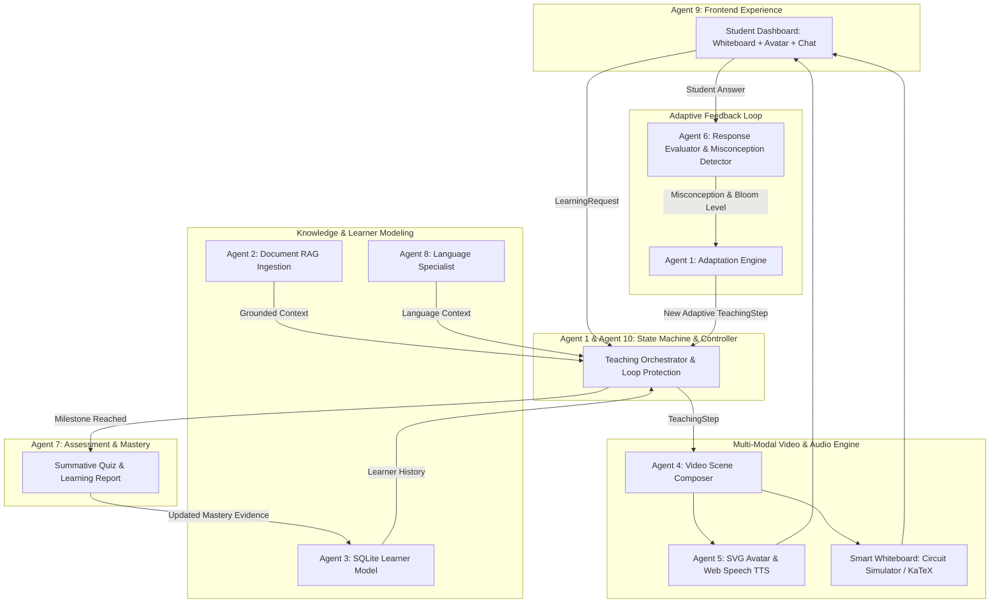

# 🎓 AI Teacher: Human-Like Adaptive AI Educator That Teaches Through Video

> **AI Innovation Hackathon 2026** — Flagship Submission  
> *Built by an autonomous 10-Agent Collaborative Engineering Pipeline*

---

## 1. Project Title & Identity
**AI Teacher** is a human-like, multi-modal digital educator that teaches complex STEM and conceptual curricula through synchronous video, natural voice, animated avatar, and interactive whiteboard simulations.

Unlike conventional chatbots that simply output walls of text, **AI Teacher** establishes an active pedagogical teaching loop: it plans structured curricula, explains concepts with visual analogies, asks targeted questions, diagnoses conceptual misconceptions, adapts its teaching strategy dynamically, conducts summative mastery assessments, and updates a durable learner model.

---

## 2. Problem Statement
Digital education today is fundamentally fragmented:
- **Pre-recorded Lectures (MOOCs & YouTube):** Completely passive, one-size-fits-all, with zero awareness of whether a student is following along or hopelessly confused.
- **LLM Text Chatbots:** Unstructured, unguided, prone to hallucinations, devoid of visual pedagogical scaffolding, and incapable of step-by-step visual demonstration.
- **The Core Challenge:** Simply putting a talking avatar in front of generated text is *not* teaching. Real teaching requires dynamic visual demonstrations, interactive concept probes, misconception diagnosis, and immediate pedagogical adaptation.

---

## 3. Solution Overview
The **AI Teacher** delivers a closed-loop, human-like educational experience:
```
UPLOAD MATERIAL / TOPIC ➔ PERSONALIZATION ➔ UNDERSTAND & PLAN ➔ TEACH THROUGH VIDEO
         ▲                                                                   ▼
NEXT TOPIC / REVISION                                                AVATAR + NATURAL VOICE
         ▲                                                                   ▼
DURABLE LEARNER UPDATE ◄── LEARNING REPORT ◄── ASSESSMENT ◄── FOLLOW-UP ◄── RETEACH / ADAPT ◄── MISCONCEPTION DETECTED ◄── STUDENT RESPONSE ◄── QUESTION PROBE
```

---

## 4. Core Features
- 🧠 **Autonomous Teaching Brain:** Hierarchical lesson planning with prerequisite dependencies and Bloom's taxonomy mapping.
- ⚡ **Interactive Smart Whiteboard:** Real-time animated DC circuit electron flow simulation, step-by-step KaTeX algebraic derivations, and algorithm state tracers.
- 🗣️ **Expressive Avatar & Voice Engine:** SVG vector avatar with synchronized lip-sync mouth movements, randomized eye blinking, natural breathing, and whiteboard laser pointing.
- 🔍 **Diagnostic Misconception Detection:** Identifies exact conceptual flaws (e.g. *Inverse Proportionality Fallacy*) rather than simply grading binary right/wrong.
- 🔄 **Pedagogical Strategy Adaptation:** Injects alternative teaching strategies (e.g. Hydraulic Water Pipe Analogy) and dynamically reconfigures whiteboard visuals.
- 🛡️ **Adaptive Loop Protection:** Enforces configurable attempt limits (`MAX_RETEACH_ATTEMPTS=2`) to prevent infinite frustration cycles.
- 🌐 **Dynamic Multilingual Teaching:** On-the-fly switching between **Hinglish**, **Hindi**, and **English** with strict pedagogical state preservation.
- 📊 **Summative Assessment & Learning Report:** Multi-format diagnostic quiz producing actionable revision roadmaps and concept mastery updates.
- 🔒 **Sovereignty & Dual-Mode Resilience:** Fully operational with live Gemini LLM APIs, and equipped with zero-latency deterministic mock fallbacks for network-isolated hackathon judging.

---

## 5. Master Architecture Diagram



---

## 6. Subsystem Agent Ownership Matrix

| Agent | Responsibility | Key Module / Implementation |
|---|---|---|
| **Agent 1** | Teaching Brain & Orchestrator | `backend/app/services/orchestrator.py`, `backend/teaching/` |
| **Agent 2** | Document Intelligence & RAG | `backend/app/services/material_pipeline.py`, `backend/app/rag/` |
| **Agent 3** | Personalization & Learner Model | `backend/personalization/`, SQLite `learner_profiles.db` |
| **Agent 4** | AI Teaching Video Engine | `backend/app/services/visual_engine.py`, `SmartWhiteboard.jsx` |
| **Agent 5** | Avatar & Voice Engine | `frontend/src/components/TeacherAvatar.jsx`, `tts.js` |
| **Agent 6** | Response Evaluation & Adaptation | `backend/app/services/evaluation_engine.py` |
| **Agent 7** | Assessment & Learning Analytics | `backend/assessment/`, `assessment_engine.py` |
| **Agent 8** | Multilingual Language Specialist | `backend/app/api/routes.py` (`/sessions/{id}/language`) |
| **Agent 9** | Frontend & Teaching Experience | `frontend/src/App.jsx`, glassmorphism UI components |
| **Agent 10**| Final Integration, Tests & Docs | `backend/app/core/`, E2E test suite, complete docs package |

---

## 7. AI/ML Models & Providers
- **LLM Reasoning:** Google Gemini `gemini-3.7-flash` (or `gemini-3.6-flash`) for curriculum deconstruction and open-ended pedagogical reasoning.
- **Embeddings:** Google `text-embedding-004` (with TF/IDF keyword vector fallback).
- **Voice Synthesis (TTS):** W3C Standard Web Speech API (zero external API keys needed; supports English and Hindi voices natively).
- **Mathematical Rendering:** KaTeX engine executing client-side with millisecond typesetting.

---

## 8. RAG & Document Intelligence Pipeline
- **Upload Supported Formats:** PDF, DOCX, TXT via `POST /api/materials/upload`.
- **Extraction & Structuring:** Paragraph boundary detection, page number tracking, and metadata extraction using `pypdf`.
- **Chunking:** 120-word chunks with 20-word semantic overlap.
- **Grounding & Isolation:** Lessons generated from uploaded documents cite exact source names and page numbers in `TeachingStep.source_references`.

---

## 9. Personalization & Learner Model
The **Personalization Subsystem (Agent 3)** tracks a student's evolving cognitive state across sessions:
- **Parameters:** Educational level (beginner/intermediate/advanced), preferred language (Hinglish/Hindi/English), teaching style, available time (5/20/60 min), and desired depth.
- **Bayesian Mastery Engine:** Updates concept mastery scores upon every response:
  - Correct answer $\implies$ mastery increases proportionally to question difficulty.
  - Misconception detected $\implies$ records misconception record and reduces mastery.
  - Successful re-test $\implies$ resolves active misconception and restores trajectory.
- **Persistence:** Local SQLite database at `backend/data/learner_profiles.db`.

---

## 10. Dynamic Adaptive Teaching & Misconception Engine
The core differentiator of AI Teacher is its **diagnostic adaptation loop**:
1. Teacher asks a conceptual probe:
   > *"Agar voltage constant rahe aur resistance badhe, to current ka kya hoga?"*
2. Student submits a common intuitive fallacy:
   > *"Current increase hoga."*
3. **Agent 6 evaluates:** Flags `Inverse Proportionality Fallacy` (student confused direct multiplication $V=I\cdot R$ with division $I=V/R$).
4. **Agent 1 adapts:** Discards the abstract mathematical formula and deploys the **Hydraulic Water-Pipe Analogy**:
   > *"Koi baat nahi! Sochiye ek paani ka pipe hai. Agar aap aage valve tight kar dein (resistance badha dein), to paani ka flow kam hoga ya badhega? Zahir si baat hai, flow kam hoga! Circuits behave identically: I = V / R."*
5. **Smart Whiteboard reconfigures:** Bumps resistance to $12\Omega$ and visually slows the animated electron flow to $1\text{ A}$.

---

## 11. Summative Assessment & Learning Analytics
At the conclusion of a lesson, **Agent 7** delivers a 3-question mastery assessment:
1. **Conceptual Understanding:** Formula definition and physical meaning.
2. **Quantitative Calculation:** Numerical circuit calculation ($V=24\text{V}, R=6\Omega \implies I=4\text{A}$).
3. **Practical Application:** Real-world reasoning (e.g., ceiling fan regulators).
- **Learning Report Output:** Generates a comprehensive report detailing mastery score, concepts understood, resolved misconceptions, actionable revision advice, and suggested next learning milestone (*Kirchhoff's Laws*).

---

## 12. Multilingual Support (Agent 8)
- **Languages:** English, Hindi, and **Hinglish** (the natural blend of Hindi and English used across technical colleges in India).
- **Dynamic On-The-Fly Switching:** Changing the language mid-lesson updates dialogue narration and whiteboard equations immediately while strictly preserving curriculum position, concept graph, and learner state.

---

## 13. Voice Engine
- Driven by `frontend/src/services/tts.js`.
- Automatically selects the optimal voice for the active language.
- Publishes speech state events (`isSpeaking: true/false`) to synchronize the teacher avatar's mouth movements in real time.
- Displays a dynamic multi-bar voice wave visualizer during active speech.

---

## 14. Avatar Engine
- High-fidelity vector SVG teacher avatar rendered directly on HTML5 canvas.
- **Natural Micro-Animations:** Autonomous breathing, randomized realistic eye blinking every 3.8 seconds.
- **Synchronized Lip-Sync:** Alternates mouth open/closed frames matched to audio playback timing.
- **Interactive Gestures:** Extends an animated arm with a laser pointer directed toward key formulas on the Smart Whiteboard.
- **Emotional States:** Badges display current pedagogical disposition (`Actively Teaching`, `Encouraging & Patient`, `Deep Reasoning`, `Listening Attentively`).

---

## 15. AI Teaching Video Engine
- Rather than a passive mp4 stream, **AI Teacher** utilizes a responsive multi-modal composition:
  - Left pane: Expressive Teacher Avatar + Voice Wave.
  - Center pane: Interactive Smart Whiteboard (DC Circuit simulation with live electron speed, KaTeX math derivations, code traces).
  - Bottom pane: Spoken dialogue transcript with synchronized subtitle highlight.
  - Right pane: Real-time Adaptation HUD and curriculum progress checklist.
- The backend additionally provides `POST /api/video/generate` for asynchronous MP4 video scene composition.

---

## 16. API Specification Summary
- `POST /api/teaching/start` — Initializes learning session and plans curriculum.
- `GET /api/teaching/{session_id}/next` — Advances to next teaching step.
- `POST /api/teaching/{session_id}/respond` — Evaluates student answer & triggers adaptation.
- `POST /api/sessions/{session_id}/language` — Switches teaching language dynamically.
- `POST /api/materials/upload` — Ingests PDF/DOCX educational documents for RAG.
- `POST /api/video/generate` — Multi-modal video scene composition.
- `POST /api/voice/generate` — Voice narration synthesis.
- `POST /api/avatar/generate` — Avatar state generation.
- `GET /health` — Full subsystem health check.
- `GET /api/demo/canonical` — 1-Click hackathon demo initializer.
*(See [`docs/api.md`](docs/api.md) for full endpoint schemas).*

---

## 17. Setup & Prerequisites
- **Python:** 3.10+
- **Node.js:** 18+ & npm
- **Operating System:** Windows, macOS, or Linux

---

## 18. Environment Variables
Create a `.env` file from the provided `.env.example`:
```bash
copy .env.example .env
```
Key configuration parameters:
- `DEMO_MODE=true` (enables 1-click canonical testing)
- `ENABLE_MOCK_PROVIDERS=true` (enables deterministic fallback)
- `MAX_RETEACH_ATTEMPTS=2` (enforces adaptive loop protection)
- `GEMINI_API_KEY=` (optional: supply to enable live LLM queries for non-canonical topics)

---

## 19. Running Locally
### Start Backend
```bash
python backend/run_backend.py
```
- API Base: `http://127.0.0.1:8000`
- Swagger Docs: `http://127.0.0.1:8000/docs`
- Health Endpoint: `http://127.0.0.1:8000/health`

### Start Frontend
```bash
cd frontend
npm install
npm run dev
```
- Frontend UI: `http://localhost:5173`

---

## 20. Running the 1-Click Hackathon Demo
1. Launch both services using the Windows shortcut:
   ```powershell
   .\start.bat
   ```
2. Open `http://localhost:5173`.
3. Click **"1-Click Canonical Demo"**.
4. Experience the full teaching flow:
   - AI Teacher introduces Ohm's Law in Hinglish with voice and animated SVG avatar.
   - Smart Whiteboard displays interactive DC circuit ($12\text{V}, 4\Omega, 3\text{A}$) with animated electron current.
   - Click **"Next Concept"** to reach the question probe.
   - Click the preloaded demo answer: **`"Current increase hoga."`** and submit.
   - Watch the **Adaptation HUD** diagnose the `Inverse Proportionality Fallacy` and switch to the **Water-Pipe Analogy**.
   - Observe the whiteboard dynamically re-render at $12\Omega$ with constricted $1\text{A}$ electron flow.
   - Answer the follow-up correctly: **`"Current kam hokar 1A ho jayega."`**
   - Complete the summative assessment and examine the generated **Learning Report**.

---

## 21. Automated Testing & Verification
The repository includes a comprehensive 54-test automated verification suite covering unit models, RAG retrieval, personalization, evaluation, loop protection, multilingual switching, and HTTP endpoints:
```bash
python -m pytest backend/tests -v
```
**Test Status:** `54 passed in 1.85s (100% Pass Rate)`.

---

## 22. Limitations & Engineering Boundaries
- **Avatar Render Mode:** Vector SVG animation on HTML5 Canvas provides instantaneous 60fps local rendering with zero latency, but does not use photorealistic 3D diffusion skin rendering.
- **OCR:** Ingestion targets digital PDF, DOCX, and TXT files. Raster-only scanned images without OCR text layers require external pre-processing.
- *(See [`docs/limitations.md`](docs/limitations.md) for full disclosures).*

---

## 23. Third-Party Services Disclosure
- **Google Gemini API (`gemini-3.7-flash` / `gemini-3.6-flash`):** Cloud LLM reasoning (equipped with deterministic local fallback).
- **W3C Web Speech API:** Standard browser voice engine (zero external API keys or cloud dependencies).
- **KaTeX:** High-speed client-side mathematical typesetting.
- **PyPDF:** Open-source local document parser.
- *(See [`docs/third-party-services.md`](docs/third-party-services.md) for full compliance matrix).*

---

## 24. Future Roadmap
- 🔬 **Hands-On Virtual Lab:** Interactive component breadboard allowing students to physically wire resistors, capacitors, and oscilloscopes.
- 📱 **Mobile Offline App:** Progressive Web App (PWA) with quantized local ONNX speech models for off-grid rural education.
- 🌐 **Expanded Indic Vernacular:** Native Tamil, Telugu, Kannada, and Marathi teaching dialects.

---

## 📚 Complete Documentation Index
- 🏛️ [Master Architecture Guide](docs/architecture.md)
- 🎭 [Hackathon Demo Presentation Script](docs/demo-script.md)
- 🔌 [Complete REST API Reference](docs/api.md)
- 📋 [Challenge Requirement Traceability Matrix (100% Score Alignment)](docs/requirement-matrix.md)
- 🚀 [Deployment & Setup Guide](docs/deployment.md)
- 🔒 [Third-Party Services & Model Disclosure](docs/third-party-services.md)
- ⚠️ [Prototype Limitations & Engineering Disclosures](docs/limitations.md)
