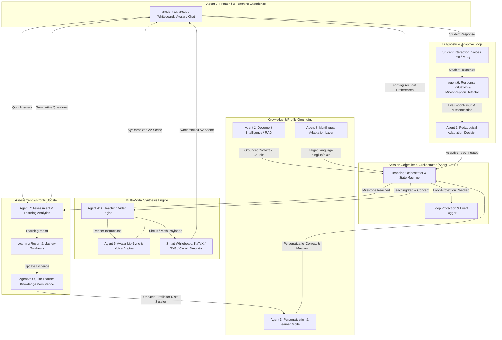

# Master Architecture & Subsystem Integration Guide

**Project:** AI Teacher: Build a Human-Like AI Educator That Teaches Through Video  
**Role:** AGENT 10 — Integration, Demo Orchestration & Documentation  
**Version:** 1.0.0 (Production / Hackathon Final)

---

## 1. Executive Summary

Traditional digital learning platforms typically alternate between static recorded video lectures and disconnected text-based chatbots. The **AI Teacher** replaces this paradigm with a **closed-loop, adaptive, multi-modal educator**. It integrates document intelligence (RAG), personalized student modeling, real-time video and dynamic visual synthesis, expressive synchronized voice narration, diagnostic misconception detection, automatic pedagogical adaptation, and summative learning analytics into a single cohesive runtime.

---

## 2. High-Level Master Architecture Diagram



---

## 3. Detailed Subsystem Ownership & Agent Matrix

| Agent | Subsystem Name | Primary Responsibilities | Key Files / Modules |
|---|---|---|---|
| **Agent 1** | Teaching Brain & Orchestrator | Lesson planning, prerequisite sequencing, pedagogical state machine, teaching step synthesis | `backend/app/services/orchestrator.py`, `backend/teaching/` |
| **Agent 2** | Document Intelligence & RAG | Document ingestion (PDF/DOCX/TXT), semantic chunking, grounded retrieval, source attribution | `backend/app/services/material_pipeline.py`, `backend/app/rag/` |
| **Agent 3** | Personalization & Learner Model | Student profiling, persistent knowledge state, Bayesian/deterministic mastery scoring, SQLite persistence | `backend/personalization/`, `backend/data/learner_profiles.db` |
| **Agent 4** | AI Teaching Video Engine | Video composition, layout orchestration (avatar + voice + visual board), scene timeline | `backend/app/services/visual_engine.py`, `frontend/src/components/SmartWhiteboard.jsx` |
| **Agent 5** | Avatar & Voice Engine | High-fidelity animated SVG avatar, real-time lip-sync phonemes, natural Web Speech / neural TTS | `frontend/src/components/TeacherAvatar.jsx`, `frontend/src/services/tts.js` |
| **Agent 6** | Response Evaluation & Adaptation | Deep pedagogical diagnosis, misconception identification, knowledge gap extraction | `backend/app/services/evaluation_engine.py`, `backend/teaching/providers/response_evaluator.py` |
| **Agent 7** | Assessment & Learning Analytics | Summative question generation, multi-format scoring (MCQ/numeric/open-ended), learning reports | `backend/assessment/`, `backend/app/services/assessment_engine.py` |
| **Agent 8** | Multilingual Language Layer | Dynamic multi-language adaptation (English, Hindi, Hinglish), phonetic consistency | `backend/app/api/routes.py`, `backend/app/services/adaptation_engine.py` |
| **Agent 9** | Frontend Experience | Glassmorphism UI, interactive Whiteboard, Adaptation HUD, Progress tracker, Audio sync | `frontend/src/` |
| **Agent 10** | Integration & Orchestration | Master contracts, startup validation, loop protection, E2E tests, `.env.example`, docs | `backend/app/core/`, `backend/tests/test_end_to_end_integration.py`, `docs/` |

---

## 4. End-to-End Information Flow

### Stage 1: Initiation & Personalization
1. The student selects an educational topic (e.g. *Ohm's Law & Circuit Dynamics*) or uploads syllabus material (`.pdf`, `.docx`, `.txt`).
2. The student specifies pedagogical preferences:
   - **Educational Level:** Beginner / Intermediate / Advanced
   - **Preferred Language:** Hinglish / Hindi / English
   - **Teaching Style:** Analogy-driven / Visual / Step-by-step
   - **Available Time:** 5, 20, or 60 minutes
   - **Desired Depth:** Intuitive / Standard / Deep Dive
3. The **Session Controller** initiates a `LearningRequest` and queries the **Learner Model (Agent 3)** to fetch historical mastery and diagnosed weak areas. If uploaded material is supplied, the **RAG Pipeline (Agent 2)** retrieves grounded text chunks with source page attribution.

### Stage 2: Lesson Planning & Teaching Step Progression
1. **Agent 1 (Lesson Planner)** generates a structured `LessonPlan` featuring ordered concepts, prerequisites, and formative probe checkpoints.
2. The first `TeachingStep` is dispatched to the client with:
   - Teacher spoken explanation
   - Whiteboard visual instruction (`circuit`, `math_derivation`, `code_trace`, or `concept_map`)
   - Teacher avatar emotion (`explaining`, `attentive`, `thoughtful`, `encouraging`, `celebrating`)
3. **Agent 4 & 5 (Video & Avatar Engine)** render the teacher avatar with synchronized lip-sync and live audio narration alongside the interactive whiteboard.

### Stage 3: Formative Questioning & Diagnostic Evaluation
1. The teacher delivers a conceptual question probe:
   > *"Agar circuit mein Voltage constant rahe aur Resistance badha dein, to Current ke sath kya hoga?"*
2. The student submits their response (e.g., *"Current increase hoga"*).
3. The **Response Evaluator (Agent 6)** analyzes the answer against the pedagogical goal and identifies the underlying misconception:
   - **Misconception:** *Inverse Proportionality Fallacy* (confusing direct multiplication in $V = I \cdot R$ with division in $I = V / R$).
   - **Pedagogical Action:** `give_analogy`.

### Stage 4: Dynamic Pedagogical Adaptation (Step Injection)
1. **Agent 1 & Adaptation Engine** synthesize an immediate adaptive intervention step:
   - Switches explanation strategy to a real-world **Hydraulic Water Pipe Analogy** (squeezing a valve restricts flow rate).
   - Dynamically updates the **Smart Whiteboard** to simulate a high-resistance circuit (12V battery, 12Ω resistor, Current constricted to 1A).
   - Updates the Teacher Avatar to an `encouraging` posture.
   - Formulates a targeted follow-up probe question.
2. **Loop Protection (Agent 10)** monitors consecutive misconception attempts per concept (`MAX_RETEACH_ATTEMPTS = 2`). If a student continues to struggle, the system introduces a consolidated prerequisite review rather than looping infinitely.

### Stage 5: Summative Assessment & Learning Report
1. After completing all lesson steps, the session transitions to **Summative Assessment (Agent 7)**.
2. The student solves multi-format mastery problems.
3. The system compiles a comprehensive `LearningReport`:
   - Mastery score (percentage)
   - Concepts understood
   - Weak areas diagnosed and resolved
   - Overcome misconceptions
   - Actionable revision recommendations
   - Suggested next learning topic (e.g., *Kirchhoff's Laws & Series-Parallel Circuits*)
4. The **Learner Model (Agent 3)** persists updated concept masteries into `learner_profiles.db` for subsequent learning sessions.

---

## 5. Failure Resilience & Fallback Hierarchy

To ensure uninterrupted demo delivery during live hackathon judging, every external dependency has a deterministic local fallback:

```
[Full Multi-Modal Experience]
Avatar Animation + Speech TTS + Interactive Visual Simulation + Video
        ↓ (Fallback if Audio/TTS unavailable)
[Visual + Synchronized Text Subtitles]
Interactive Canvas Simulation + Dialogue Transcript
        ↓ (Fallback if Canvas WebGL unavailable)
[KaTeX Equations & Formatted Text]
        ↓ (Fallback if External LLM Key missing)
[Deterministic Pedagogical Mock Pipeline (Zero Latency)]
```
